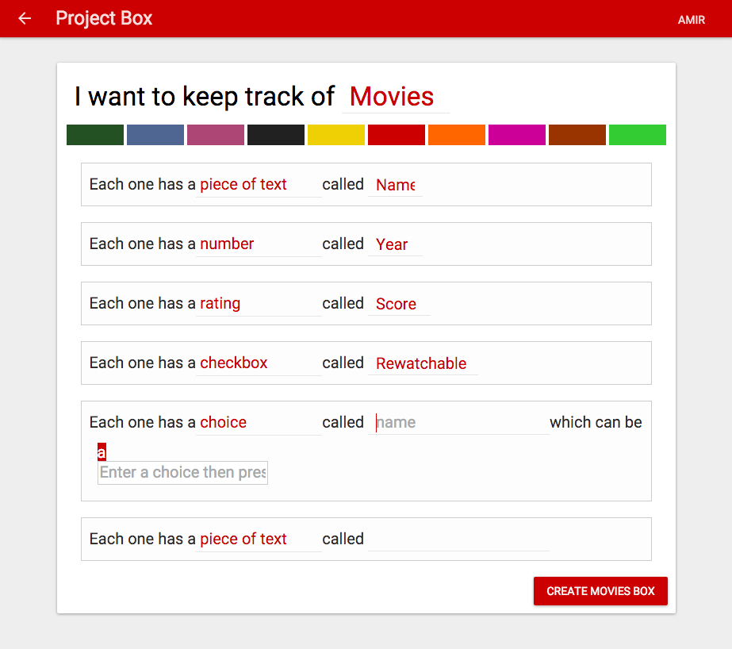
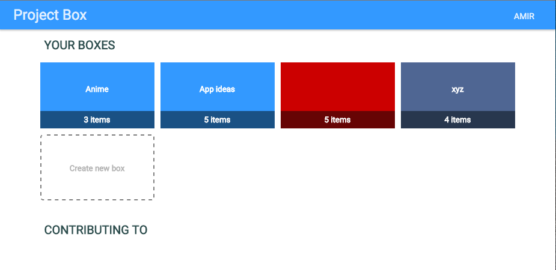
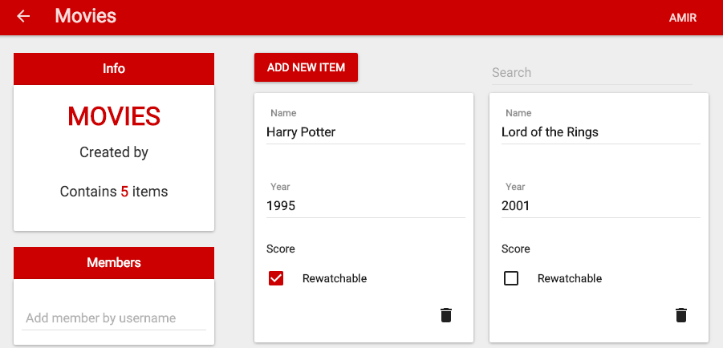
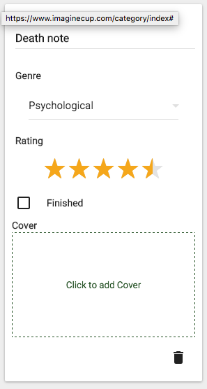

##ProjectBox

This web app lets the user keep track of their own data.

The user defines a box - a list of properties that define the data inside it. 

Example : A movie has a `piece of text` called `Name` , a `number` called `Release Year` , a `tag list` called `Actors` , a `rating` called `Score`

It then allows the user to filter and sort through their data set

The user can also share their boxes with other users

